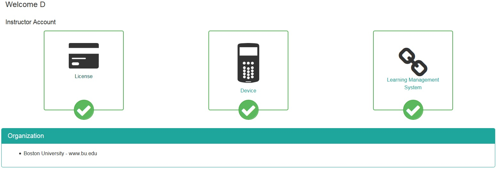

# Registering Your Device for CS 131 

#### Sign on Your Turning Technologies (TT) Account Through Blackboard

1. Visit Blackboard and click on CS131 (Spring 2017).
2. Once you have logged in, there should be a _TT Account Registration_ link on the left menu panel.
Click the link, and you will be redirected to a login page for TurningTechnologies.   

> YOU MUST GO TO THE TURNINGPOINT SITE FROM THE BLACKBOARD LINK. DO NOT NAVIGATE TO THE PAGE DIRECTLY.

3. Use your BU email address to sign in to your TT account or to create a TT account if you do not have one yet.

#### Registering a Device

Once you have created an account, you should see your dashboard on the main TurningPoint screen.

Click the middle icon labeled ‘Device’. This will bring you to the device registration page. Once you are on that page, click the box with the ‘+’ icon and ‘Add a device’. Enter the device number on the back of your clicker (it will be six hexadecimal values). Click ‘Register’ to activate the clicker.

#### Registering a License

To register a license, go back to the main dashboard screen (as seen above), and click the icon to the left labeled ‘License’. This will bring you to the license registration page. Once you are on that page, click the box with the ‘+’ icon and ‘Add a License’. Enter the license code on the piece of paper given to you when you were given a clicker. Click ‘Redeem’ to activate the License.

#### Purchasing a License Directly from TurningPoint

To purchase a license on its own, navigate to the main TurningPoint screen or click the link titled ‘Dashboard’. On the left portion of the screen, you should see several links on the toolbar. Click the link titled ‘Student Store’ and follow the instructions to purchase a license. 