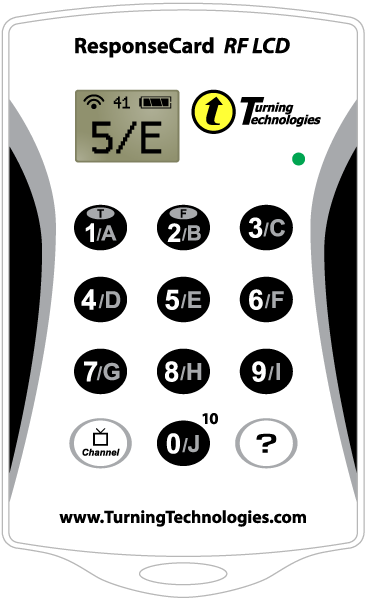

# Student-Response Device

The student-response device in the form of a smartphone app or clicker represents an innovation in classroom teaching. The device will allow you to respond to the instructor’s questions in real time.

 

You answer by selecting a button on the smartphone app or clicker device. Then, within a few seconds, a graph that shows how students answered will appear on the classroom screen, and I will tell you what the correct answer was.

- To use your smartphone app: At the beginning of each lecture, after I have set up my laptop, you must “Join” the session.  To do that, enter __CS131__ in the app box marked “Session ID.”

- To use your clicker: Be sure that your clicker set to Channel __41__.  If you are not sure, push the Channel button, then 4, then 1, then Channel again.  You do not need to use the Channel button again unless you have changed your channel for another class.  Your clicker is always on.

On the average, I will ask 3-4 clicker questions during each lecture class: a review question at the beginning of class and an average of three questions on topics covered during the lecture. The answers of individual students are automatically recorded in the instructor’s computer. The distribution of student answers will be displayed on the classroom screen. Of course, no information about individual student responses will be released.

I suggest you buy your response device (either smartphone app or clicker) during the first week of classes (not before).   When you are ready to buy the response device, [click here](clicker.html).